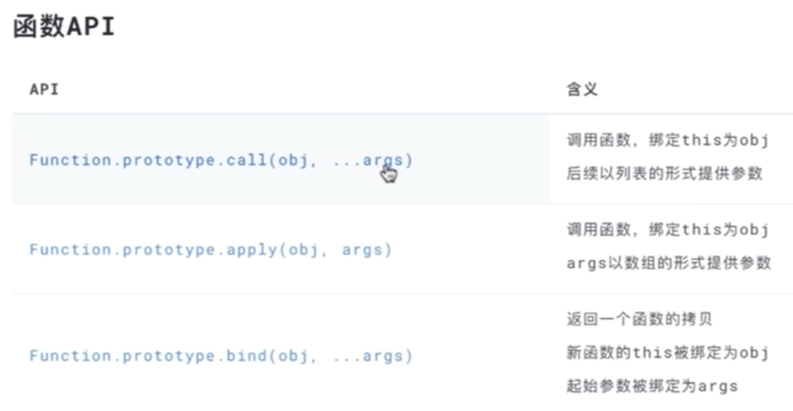

# 涉及知识点
## 高阶函数
**1. 概念**
高阶函数指的是接受一个或多个函数作为参数，或者返回一个函数的函数
-   函数参数：一个或多个函数
-   或 返回：返回一个函数

函数作为参数
``` javascript
const arr = [2,3,4,4]
arr.map(fn) // fn作为函数参数
arr.forEach(fn) // fn作为函数参数
window.addListenerEvent('eventName',fn)// fn作为函数参数
setTimeout(()=> {

}) // 等都是
```
返回一个函数
``` javascript
function aa(){}
let b = aa.bind({}) // 返回一个新函数
```
**2. 高阶函数目的**
> 运算这个概念 参考知识点：函数式编程(函数&运算的关系)
- 运算的缺失
``` javascript
function map(fn) {
    let result = []
    for(let i=0; i<原数组.length-1;i++) {
        // 原数组[i] -> 新值(需要通过一个运行确定转换规则-运算缺失)
        fn(原数组[i]) -> 新值 // 通过fn提供的转换逻辑，计算出新值
        result.push(新值)
    }
}
```
- 运算的延续
``` javascript
function bind(thisArg) {
    const fn = 绑定了this的函数
    return fn // 返回一个fn 供外部未来调用
}
const b = a.bind({})
```
**3. 如果编写一个高阶函数**
- 使用
就是js语言已经封装好的 map each等
- 编写
例子：见：给Fetch添加超时功能

## bind apply call
- call apply 作用就是绑定this指向，立即执行。参数格
- bind 作用就是绑定this指向-> 返回一个新的函数
- call apply bind 都是函数原型上的方法
``` javascript
const arr = [1, 3, 4, 5, 2]
// const newArr = arr.slice(1, 3)
// console.log(newArr)
const newArr = Array.prototype.slice.call(arr, 1, 3);
const newArr1 = Array.prototype.slice.apply(arr, [1, 3]);
console.log(newArr)
console.log(newArr1)
// 1. call apply 作用就是绑定this指向，立即执行。参数格式不同
const newSlice = Array.prototype.slice.bind(arr);
console.log(newSlice(1, 3))
// 2. bind 作用就是绑定this指向-> 返回一个新的函数
// 3. call apply bind 都是函数原型上的方法
```
 
## 函数式编程(函数&运算的关系)

# 给fetch添加超时功能
``` javascript
// 给fetch添加超时功能
// 方法1
// function request(url, options){
//     const timeout = options.timeout || 5000;
// }
// 上面这种做法存在问题：1. 每一次request 都要传入timeout 这个配置，当然也可以不传，都默认5000.那这样还不如写死，如果写死，又不能跨项目通用了。所以不太好

// 方法2
// const oldFetch = window.fetch;
// window.fetch = () => {
//     //xxxx
// }
// 上面这种做法存在问题：太粗暴，影响范围很广

// 方法3-高阶函数
// 思路：1.首先创建一个高阶函数(返回一个新的函数)-> 可以生成多个应用实例函数 根据传入的timeout不同。。服用+跨项目
function createFetchWithTimeout(timeout) {
    return function (url, options) {
        // 思路2:返回一个promise: 因为要添加超时功能 ，在内部处理 fetch 和 setTimeout的返回，在修改promise状态
        return new Promise((resolve, reject) => {
            // 思路4: 取消请求
            const singalController = new AbortController();
            fetch(url, {
                ...options,
                signal: singalController.signal
            }).then(resolve, reject)
            setTimeout(() => {
                reject('超时了');
                singalController.abort();
            }, timeout)
            // 思路3: fetch返回数据 和 setTimeout 相比较，哪个先结束，内部代码先运行去修改promise状态，一旦修改promise状态被确认
        })

    }
}
const request1 = createFetchWithTimeout(5000)
const request2 = createFetchWithTimeout(6000)
```

